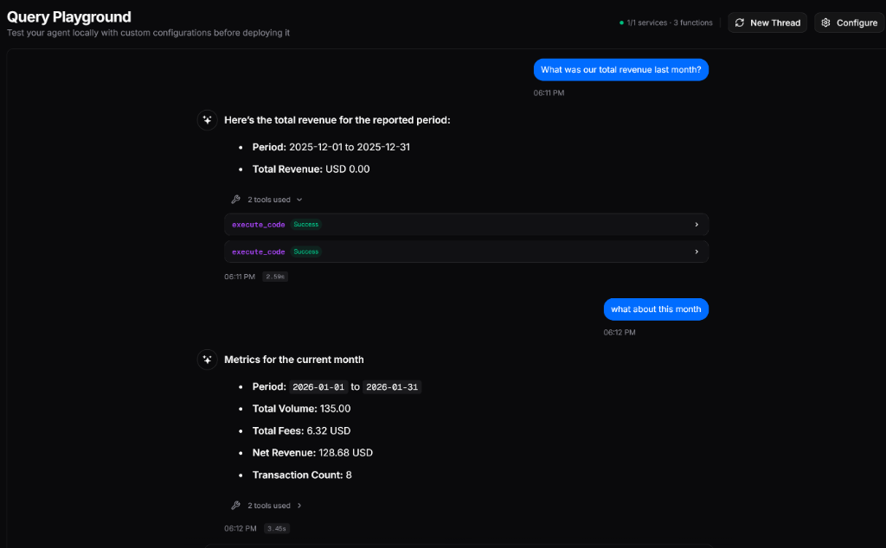
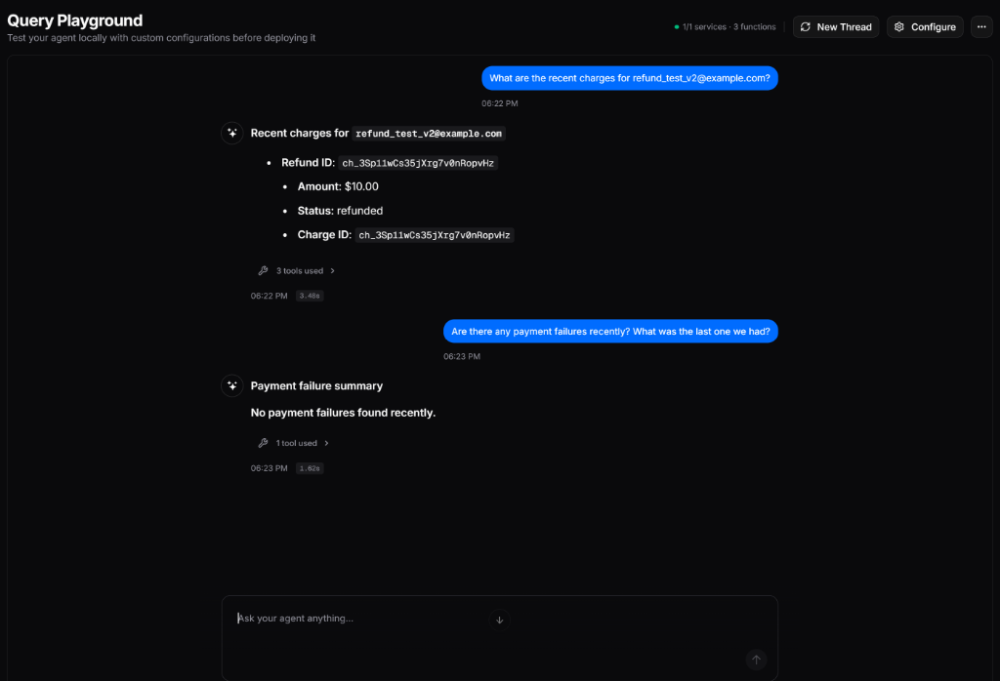

# Stripe Finance Agent (Daemo Edition)

A production-grade AI Financial Assistant built with the **Daemo Engine**. This agent connects your LLM to live Stripe data, enabling natural language queries for revenue analytics, payment investigations, and secure refunds.

## ✨ Features

*   **Revenue Intelligence**: Analyze volume, fees, and net revenue over any date range.
*   **Support Ops**: Instantly find failed charges and failure reasons by customer email.
*   **Secure Refunds**: Process refunds with built-in safety checks and human-confirmation logic.
*   **Dual-Interface**:
    *   **Daemo Hosted**: Connects securely to the Daemo Dashboard.
    *   **REST API**: Exposes a local `/agent/query` endpoint for custom integrations.

## 📸 Demo

### 1. Revenue Intelligence
The agent can calculate complex financial metrics over any date range.


*The Agent successfully calculating total revenue, fees, and net profit for January 2026, handling natural language date queries.*

### 2. Support & Refunds
The agent can investigate customer history to find failed payments and verify refunds.


*The Agent finding a specific refund (ID: `ch_3Sp...`) for a customer and confirming no other recent failures exist.*

## 🛠️ Architecture

*   **Runtime**: Node.js & TypeScript
*   **Framework**: Express (HTTP) & Daemo Engine (AI SDK)
*   **Validation**: Zod Schemas (Strict input/output typing)
*   **Security**: Minimal scope Stripe keys + Idempotency protections

## 🚀 Quick Start

### 1. Prerequisites
*   Node.js v16+
*   Stripe Account (Test Mode keys recommended)
*   Daemo Account (for Agent API Key)

### 2. Installation
```bash
git clone <your-repo-url>
cd stripe-finance-agent
npm install
```

### 3. Configuration
Create a `.env` file in the root directory:

```env
# Stripe Keys (Dashboard -> Developers -> API Keys)
STRIPE_SECRET_KEY=sk_test_...

# Daemo Keys (app.daemo.ai)
DAEMO_AGENT_API_KEY=daemo_...

# Optional
PORT=5000
```

### 4. Run the Agent
```bash
# Development Mode
npm run dev
# OR directly:
npx ts-node src/index.ts
```

Output:
```
[Daemo] Hosted connection started successfully
🚀 HTTP Server running on http://localhost:5000
```

## 🔌 Usage

### Via REST API
You can query the agent directly via HTTP:

```bash
curl -X POST http://localhost:5000/agent/query \
  -H "Content-Type: application/json" \
  -d '{"query": "How much revenue did we make last week?"}'
```

### Via Daemo Dashboard
search for "stripe-finance-agent" in your Daemo workspace to chat with it visually.

## 📚 Tool Reference

| Tool Name | Description | Required Inputs |
| :--- | :--- | :--- |
| **`getFinancialMetrics`** | Revenue analytics engine. | `start_date`, `end_date` (ISO-8601) |
| **`investigatePaymentFailure`** | Investigation detective. | `customer_email` |
| **`executeSecureRefund`** | Refund processor (Sensitive). | `charge_id`, `reason` |

## 🧪 Verification
Run the included verification suite to test against live Stripe API:

```bash
npx ts-node verification/verify_revenue.ts
npx ts-node verification/verify_refund.ts
```

## License
MIT
